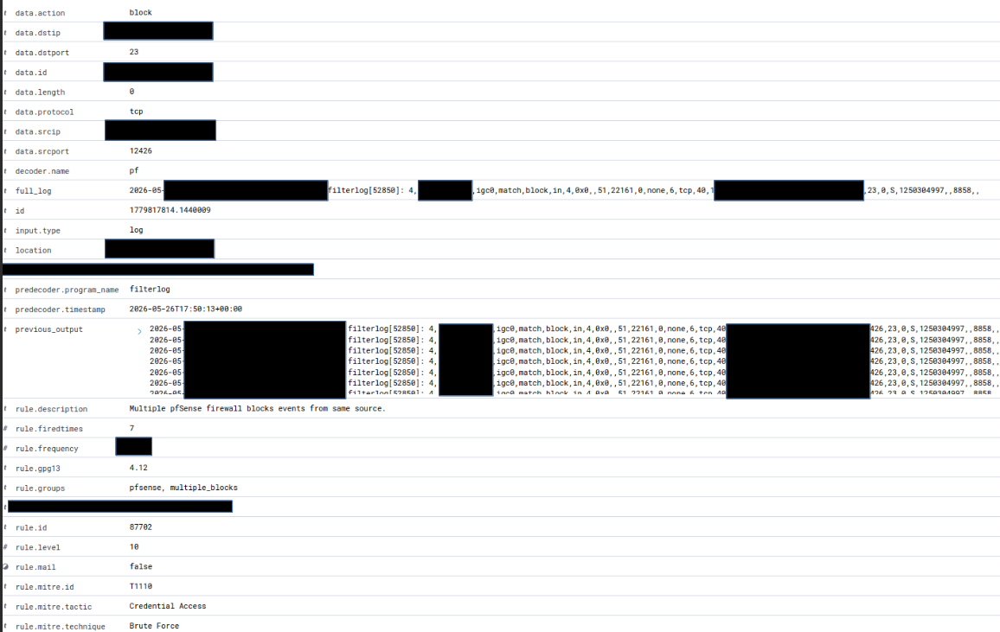

# Detection: Repeated Inbound Telnet Attempts Blocked by pfSense and Alerted in Wazuh

> **TL;DR:** Repeated inbound TCP/23 (Telnet) connection attempts from an external source were blocked by pfSense at the WAN interface. Wazuh correlated multiple firewall block events from the same source and generated a MITRE ATT&CK-mapped alert. No internal system was reached. Pipeline validated end-to-end.

**Tags:** `pfSense` `Wazuh` `Telnet` `T1110` `Firewall` `Home SOC Lab` `Detection Engineering`

---

## Overview

This document covers a successful detection in the Home SOC Lab where repeated inbound connection attempts against TCP port 23 (Telnet) were blocked by pfSense and surfaced as a correlated alert in Wazuh.

The activity was observed through pfSense firewall telemetry forwarded into Wazuh using a syslog ingestion pipeline. Wazuh decoded the firewall logs, correlated repeated block events from the same source, and generated an alert mapped to MITRE ATT&CK technique T1110: Brute Force.

This detection validates the end-to-end telemetry path from firewall log generation to SIEM alert visibility.

---

## Detection Summary

| Field | Value |
|---|---|
| Detection Source | pfSense firewall logs |
| SIEM Platform | Wazuh |
| Log Source | `<redacted>` |
| Decoder | `pf` |
| Firewall Action | Block |
| Direction | Inbound (WAN) |
| Protocol | TCP |
| Destination Port | 23 (Telnet) |
| Alert Type | Multiple firewall blocks from same source |
| Wazuh Rule ID | `<redacted>` |
| Rule Level | High severity |
| MITRE ATT&CK Technique | T1110 — Brute Force |
| MITRE ATT&CK Tactic | Credential Access |
| Outcome | Blocked at firewall — no internal access |

---

## Environment

This detection occurred in a Home SOC Lab using the following stack:

- **pfSense** — perimeter firewall
- **Wazuh** — SIEM and alert correlation
- **Ubuntu Server** — Wazuh manager node
- **rsyslog** — syslog ingestion from pfSense
- Dedicated firewall telemetry log file on the Wazuh server

### Telemetry Pipeline

```
pfSense (filterlog)
  → Remote Syslog
  → rsyslog on Wazuh server
  → Dedicated pfSense log file
  → Wazuh logcollector
  → Wazuh decoder (pf)
  → Wazuh correlation engine
  → Wazuh Dashboard alert
```

---

## Alert Details

Wazuh generated an alert after correlating multiple blocked inbound firewall events from the same external source within a short window.

```
rule.description : Multiple pfSense firewall block events from same source
rule.id          : <redacted>
rule.level       : <redacted>
rule.groups      : pfsense, multiple_blocks
rule.mitre.id    : T1110
rule.mitre.tactic: Credential Access
rule.mitre.technique: Brute Force
decoder.name     : pf
location         : <redacted>
```

---

## Decoded Event Fields

Key fields extracted by the Wazuh `pf` decoder:

| Field | Value | Meaning |
|---|---|---|
| `data.action` | `block` | pfSense blocked the connection |
| `data.protocol` | `tcp` | TCP connection attempt |
| `data.dstport` | `23` | Destination port — Telnet |
| `data.srcip` | `<redacted>` | External host initiating the connection |
| `data.dstip` | `<redacted>` | Public WAN interface IP |
| `data.srcport` | `<redacted>` | Randomized source port (typical of scanners) |
| `decoder.name` | `pf` | Wazuh pfSense firewall decoder |
| `predecoder.program_name` | `filterlog` | pfSense kernel filter log process |
| `location` | `<redacted>` | File monitored by Wazuh logcollector |
| `agent.id` | `<redacted>` | Wazuh collection agent identifier |

---

## Sanitized Raw Log Example

```
<timestamp> <pfsense_hostname> filterlog[<redacted>]: <rule_id>,<interface>,match,block,in,4,...,tcp,...,<src_ip>,<dst_ip>,<src_port>,23,...
```

**Interpretation:**
- An external host initiated an inbound TCP connection to the public WAN IP on port 23
- pfSense matched a WAN block rule against the traffic
- The connection was dropped before reaching any internal system

---

## Why Port 23 (Telnet) Matters

TCP/23 is associated with Telnet — an outdated remote access protocol that transmits all data, including credentials, in cleartext. It has been deprecated in favor of SSH for over two decades but remains a common target for automated internet scanners and botnets.

Telnet is frequently probed because:
- Legacy and IoT devices sometimes have Telnet enabled by default
- Exposed Telnet services are trivially brute-forceable due to no encryption
- Scanners can attempt credential guessing with no risk of detection at the protocol level

In this lab environment, **no internal device is running Telnet and no WAN port forwarding exists for TCP/23**. The traffic was destined for the public WAN IP and was dropped at the firewall before any internal host could receive it. The risk to this environment was low, but the activity is worth tracking — repeated probing from the same source is a meaningful signal regardless of whether it succeeds.

---

## MITRE ATT&CK Mapping

| Field | Value |
|---|---|
| Technique ID | T1110 |
| Technique Name | Brute Force |
| Tactic | Credential Access |

**Note on mapping precision:** The alert is mapped to T1110 (Brute Force) based on Wazuh's correlation of repeated blocked connection attempts from the same source. Since the traffic never passed the firewall, the intent cannot be confirmed — this could reflect credential guessing (T1110.001) or simply automated port scanning. The mapping is reasonable given the pattern, but the more accurate characterization is **blocked inbound scanning/probing** with brute-force characteristics.

---

## Detection Flow

```
1.  External host initiated inbound TCP/23 connection to public WAN IP
2.  pfSense evaluated traffic on the WAN interface
3.  WAN block rule matched — connection dropped
4.  pfSense generated a filterlog entry via the kernel pf subsystem
5.  Remote syslog forwarded the event to the Wazuh server
6.  rsyslog received the event and wrote it to the dedicated pfSense log file
7.  Wazuh logcollector detected new entries in the monitored log file
8.  Wazuh decoded the event using the built-in pf decoder
9.  Wazuh correlated repeated block events from the same source IP
10. Correlation rule fired — high-severity alert generated
11. Alert visible in Wazuh Dashboard with MITRE ATT&CK mapping
```

---

## Validation Steps

The detection was validated by confirming each stage of the telemetry pipeline independently.

### 1. Confirm pfSense syslog traffic was reaching the Wazuh server

```bash
sudo tcpdump -nn -vv -i any 'udp port <redacted>'
```

**Purpose:** Confirm pfSense was actively sending syslog traffic to the Wazuh server.

---

### 2. Confirm rsyslog was writing pfSense logs to the dedicated file

```bash
sudo tail -f <redacted>
```

**Expected result:** Fresh `filterlog` entries appearing in real time.

---

### 3. Confirm Wazuh logcollector was monitoring the file

```bash
sudo grep -i "<redacted>" <redacted>
```

**Expected confirmation:**

```
wazuh-logcollector: INFO: Analyzing file: '<redacted>'
```

---

### 4. Confirm alert visibility in the Wazuh Dashboard

**Dashboard path:** `Wazuh Dashboard → Threat Hunting → Events`

**Search terms:** `filterlog`, `pfsense`

Alert confirmed visible with decoded pfSense fields and MITRE ATT&CK mapping applied.

---

## Security Assessment

### Impact

No confirmed compromise. Traffic was blocked at the WAN firewall before reaching any internal system. No internal host received or responded to the connection attempts.

### Severity

**Medium** — from a detection and monitoring perspective. The traffic was blocked, but repeated connection attempts from the same external source indicate automated scanning or credential-probing activity. This warrants tracking even when blocked.

### Classification

> Blocked inbound reconnaissance / automated internet background scanning with brute-force characteristics

### Likely Explanation

The most probable explanation is **automated internet background scanning** targeting Telnet. This type of traffic is common against any public-facing IP address and does not necessarily indicate that this environment was specifically targeted. The pattern is consistent with botnets and mass-scanning tools that sweep broad IP ranges for exposed services.

---

## Response Actions

### Actions Taken

- Reviewed Wazuh alert details and confirmed rule metadata
- Confirmed firewall action was `block` in decoded fields
- Confirmed destination port was TCP/23
- Confirmed event originated from pfSense firewall logs via filterlog
- Confirmed Wazuh correlated repeated attempts from the same source
- Confirmed no WAN port forwarding exists for TCP/23
- Confirmed pfSense WAN rules deny all unsolicited inbound traffic by default
- Confirmed no evidence of successful access

### Recommended Ongoing Checks

- Monitor for continued repeated attempts from the same source IP — persistence may warrant a manual block rule
- Review top blocked destination ports over time to identify other probe targets
- Track recurring external source IPs if probing activity escalates in frequency

---

## Outcome

| Item | Status |
|---|---|
| Firewall blocked traffic | Confirmed |
| pfSense generated firewall logs | Confirmed |
| Logs forwarded to Wazuh server via syslog | Confirmed |
| rsyslog wrote logs to dedicated pfSense log file | Confirmed |
| Wazuh logcollector processed the file | Confirmed |
| Wazuh decoded the event using pf decoder | Confirmed |
| Wazuh generated correlated high-severity alert | Confirmed |
| MITRE ATT&CK mapping present (T1110) | Confirmed |
| No WAN port forwarding for TCP/23 | Confirmed |
| Evidence of compromise | Not observed |

---

## Lessons Learned

- Firewall **block** events are valuable security telemetry — blocked traffic still tells a story
- Wazuh can decode pfSense `filterlog` events natively using the built-in `pf` decoder
- Repeated blocked attempts from the same source trigger higher-severity correlation rules, surfacing low-signal events into actionable alerts
- MITRE ATT&CK mappings translate raw firewall noise into security-relevant context, but analyst judgment is still required to refine the classification
- Validating a detection pipeline means confirming every stage independently — not just checking whether the dashboard shows an alert
- A complete pipeline validation confirms: log generation → forwarding → local file ingestion → SIEM collection → decoding → correlation → alerting → analyst review

---

## Operational Takeaway

This detection validated the Home SOC Lab telemetry pipeline from pfSense to Wazuh. The event demonstrated that the lab can:

- Collect real firewall telemetry from a production-grade perimeter device
- Ingest and parse pfSense `filterlog` events into a dedicated SIEM
- Decode structured firewall fields using the Wazuh `pf` decoder
- Correlate repeated blocked activity into a single actionable alert
- Map detections to MITRE ATT&CK tactics and techniques
- Support SOC-style investigation and validation workflows

**This is a confirmed detection of blocked inbound Telnet probing with no evidence of compromise.**

---

## Screenshots


